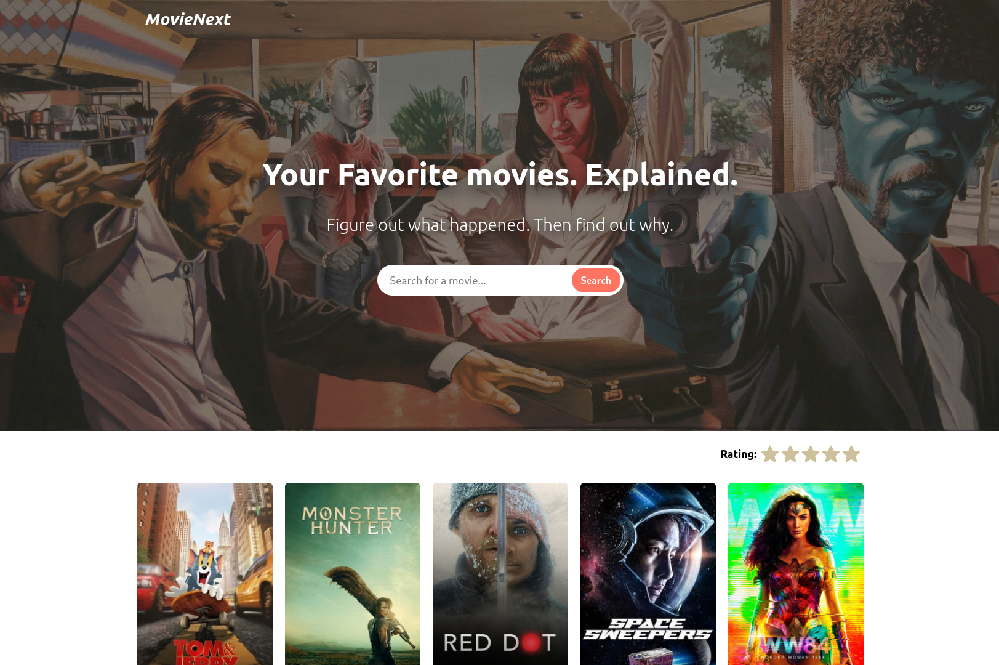

# Movie Next
Frontend programming challenge for developer candidates at Rockstar Coders 

> Just a simple React App using the [The Movie DB API](https://developers.themoviedb.org/3/getting-started/introduction).



## Features
- Search movie by query;
- Search movie by rating;
- View movie details;

## Built with
- [React](https://reactjs.org/)
- [TypeScript](https://www.typescriptlang.org/)
- [Styled Components](https://styled-components.com/)
- [Create React App](https://create-react-app.dev)

## Installation
After cloning this project the first thing you need to do is install the dependencies:
```sh
yarn
```

After that you will need to enter your The Movie DB `API_KEY` in the `src/config.ts` file.

> If you don't have an API KEY you can get one following the steps in [this page](https://developers.themoviedb.org/3/getting-started).

If you followed the previus steps you just start the server:
```
yarn start
```

## Credits
- [Design reference By Aaron Sananes](https://dribbble.com/shots/1682568-Flixus-Homepage-WIP/attachments/266476);
